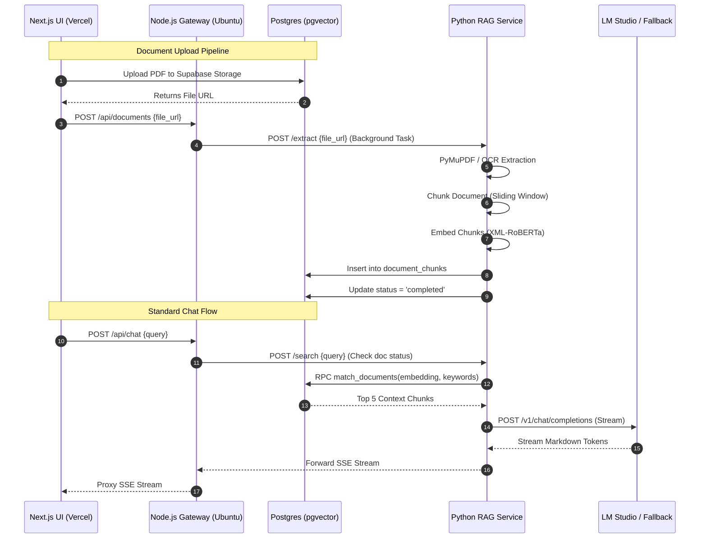

# CIVIL-LEX: Architectural & Implementation Plan

## 1. System Architecture Overview

CIVIL-LEX is a bilingual (English/Tagalog) legal hybrid Retrieval-Augmented Generation (RAG) system designed to provide accurate, citation-backed explanations of the Philippine Civil Code and Jurisprudence.

### Full Technology Stack
*   **Frontend:** Next.js (TSX), TailwindCSS, Vercel AI SDK (for streaming). Hosted on Vercel.
    *   *Caching:* **TanStack Query (React Query)** to cache fetched jurisprudence cases and prevent redundant database calls when opening popups.
*   **Gateway Backend:** Node.js (Express). Hosted locally on Ubuntu.
*   **Database:** Supabase (PostgreSQL 15+) via Local Docker.
    *   *Extensions:* `pgvector` (Vector similarity). *Note: Full-Text Search uses `tsvector` which is built natively into Postgres.*
*   **RAG Microservice:** Python (FastAPI). Hosted locally on Ubuntu.
    *   *Document Extraction:* `PyMuPDF` (for fast digital text) + `Tesseract OCR` (fallback for scanned images). *Note: PaddleOCR can be used, but Tesseract is much lighter for your Ryzen 5 hardware.*
    *   *Embeddings:* XML-RoBERTa Multilingual v1.
    *   *Vector Search:* Hybrid Search (Postgres Full-Text Search `tsvector` + `pgvector` HNSW) fused via Reciprocal Rank Fusion (RRF).
*   **LLM Inference (Primary):** Gemma 4 (E4B) hosted via LM Studio on a secondary laptop, exposed via Cloudflare Tunnel.
*   **LLM Inference (Fallback):** Groq API or Gemini Flash API (Cloud-based, for presentation reliability).

---

## 2. End-to-End Data Flow (Chat & Document Upload)



---

## 3. Database & Dataset Schema

To support both the Hybrid RAG pipeline and the complex Next.js UI requirements (Table of Contents, Jurisprudence popups, Document uploads, and Chat History), the database uses a fully normalized relational schema.

### Core Data Models (Powers the UI)

1.  **`civil_code_articles` (Table of Contents)**
    *   `article_id` (PK, e.g., 'RA386-ART1')
    *   `article_number` (INT)
    *   `hierarchy` (JSONB) - Stores the exact `{book, title, chapter, section}` object from the dataset.
    *   `content` (TEXT) - Full clean text of the article.
    *   `is_hub` (BOOLEAN) - Used to highlight heavily-cited foundational articles.
2.  **`jurisprudence_cases` (Case Popup Dialog)**
    *   `case_uid` (PK, e.g., 'GR_256194_2024')
    *   `title` (TEXT) - Case title (maps to `case_id` in dataset).
    *   `gr_number` (TEXT)
    *   `decision_date` (TEXT)
    *   `source_url` (TEXT) - Link to LawPhil/ChanRobles.
    *   `content_summary` (TEXT) - Concise LLM-generated summary from the dataset.
    *   `full_text` (TEXT) - The complete raw text (stitched from chunks during Python ingestion) so the Next.js UI can render it perfectly with original formatting in the dialog.
3.  **`article_jurisprudence_relations` (Related Cases)**
    *   `article_id` (FK to civil_code_articles)
    *   `case_uid` (FK to jurisprudence_cases)
    *   `citation_type` (TEXT) - e.g., 'interpreted', 'applied', 'mentioned' (from `jurisprudence_linkage`).
    *   *Implementation Note: This table is populated rapidly during ingestion using the pre-computed `article_case_index.json` dataset. The index is also loaded into memory by the FastAPI RAG service to instantly boost 'hub' articles without extra database joins.*

### User Uploaded Documents (Powers the Document Analysis UI)
```sql
CREATE TABLE user_documents (
  id UUID PRIMARY KEY DEFAULT uuid_generate_v4(),
  user_id UUID REFERENCES auth.users(id),
  filename TEXT,
  file_url TEXT,
  status TEXT CHECK (status IN ('uploading', 'extracting', 'completed', 'error')),
  created_at TIMESTAMPTZ DEFAULT NOW()
);
```

### RAG Vector Storage (Powers the AI)
```sql
CREATE TABLE document_chunks (
  chunk_id TEXT PRIMARY KEY,
  parent_type TEXT CHECK (parent_type IN ('article', 'case', 'user_document')),
  parent_id TEXT, -- FK to articles, cases, or user_documents
  content TEXT, -- 350-450 token chunks
  legal_topics TEXT[], 
  embedding VECTOR(768), 
  fts tsvector GENERATED ALWAYS AS (to_tsvector('english', content)) STORED
);
CREATE INDEX fts_idx ON document_chunks USING GIN (fts);
CREATE INDEX vector_idx ON document_chunks USING hnsw (embedding vector_cosine_ops);
```

### Chat History (Powers the Conversation UI)
```sql
CREATE TABLE chat_sessions (
  id UUID PRIMARY KEY DEFAULT uuid_generate_v4(),
  user_id UUID REFERENCES auth.users(id),
  title TEXT,
  created_at TIMESTAMPTZ DEFAULT NOW()
);

CREATE TABLE chat_messages (
  id UUID PRIMARY KEY DEFAULT uuid_generate_v4(),
  session_id UUID REFERENCES chat_sessions(id) ON DELETE CASCADE,
  role TEXT CHECK (role IN ('user', 'assistant')),
  content TEXT,
  citations JSONB, -- Stores the linked case_uids or article_ids
  created_at TIMESTAMPTZ DEFAULT NOW()
);
```

---

## 4. Document Analysis Pipeline (Background Task)

When a user uploads a document:
1. **Upload & Status:** The file uploads to Supabase Storage. The UI creates a `user_documents` row with `status = 'uploading'`.
2. **Extraction (Python):** A background task runs in FastAPI. It attempts `PyMuPDF` (fast text extraction). If no text is found (image PDF), it falls back to lightweight `Tesseract OCR` (or PaddleOCR if resources permit). During this, the UI polls and shows `status = 'extracting'` in the chat if they ask questions.
3. **Chunking & Embedding:** The extracted text is instantly sliced using a sliding window (350 tokens, 50 overlap), embedded using `sentence-transformers`, and inserted into `document_chunks`.
4. **Completion:** The database is updated with `progress = 100` and `status = 'completed'`, ready for querying by the LLM during chat.

---

## 5. Concrete Implementation Plan (Execution Phases)

### Phase 1: Database Setup & Data Ingestion
1. Initialize local Supabase instance using Docker.
2. Enable `vector` extension and execute the schema creation SQL.
3. **Data Ingestion Script (Python)**:
    *   **Local Embeddings**: Read `civil_code_rag.jsonl` and `jurisprudence_chunks.jsonl`. Generate embeddings locally (zero API costs) using `sentence-transformers` (XML-RoBERTa). Insert directly into `pgvector` using the Supabase Python Client in batches.
    *   **Relations Ingestion**: Iterate through the lightweight `article_case_index.json` to instantly populate the `article_jurisprudence_relations` junction table.
    *   **Full Text Reconstruction**: Stitch jurisprudence chunks together to populate the `full_text` column in `jurisprudence_cases` to serve the Next.js UI dialogs.

### Phase 2: Python RAG Microservice
1. Scaffold FastAPI and implement `/search` using XML-RoBERTa and RRF RPC.
2. Implement the `/extract` endpoint for the Document Analysis Pipeline (PyMuPDF + OCR fallback + Chunking + Embedding).
3. Implement LLM streaming with LM Studio + Cloud fallback.

### Phase 3: Node.js Gateway Service
1. Scaffold Express app with Supabase Auth middleware.
2. Create `/chat` and `/documents` proxies.

### Phase 4: Next.js Frontend Integration
1. **Chat UI:** Implement Vercel AI SDK. Render Markdown. Show document extraction loading states inside the chat.
2. **Table of Contents & Popups:** Implement the Article listing. Use **TanStack Query** to cache the full jurisprudence case fetches so the popup dialog opens instantly on subsequent clicks. Format the popup to accurately reflect the original case document structure.
