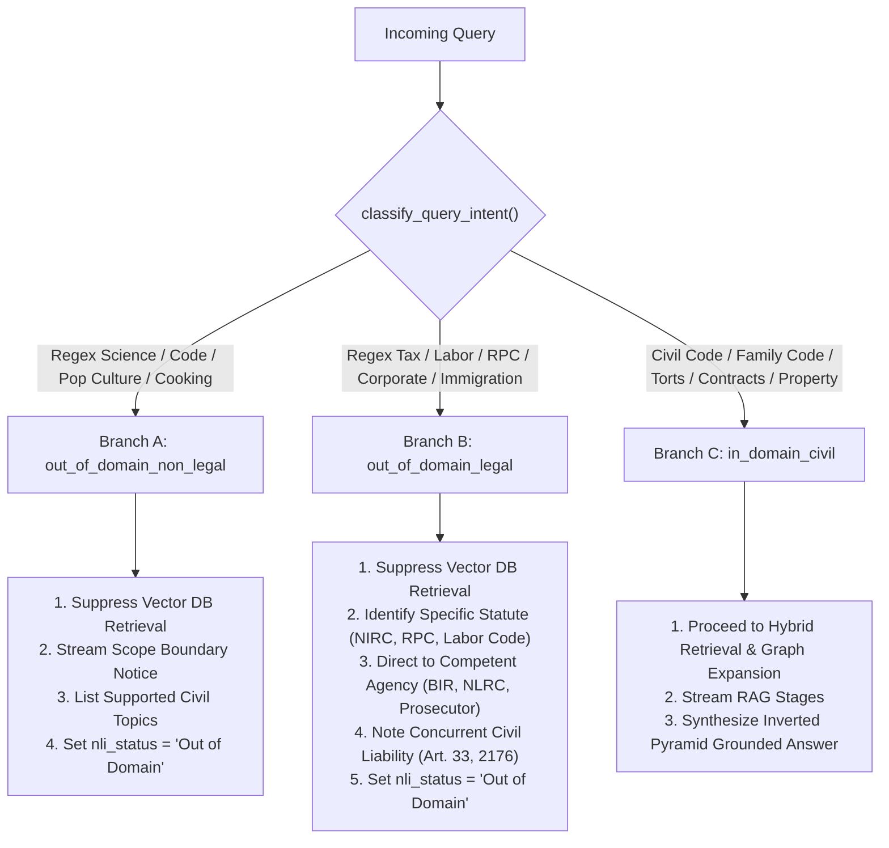
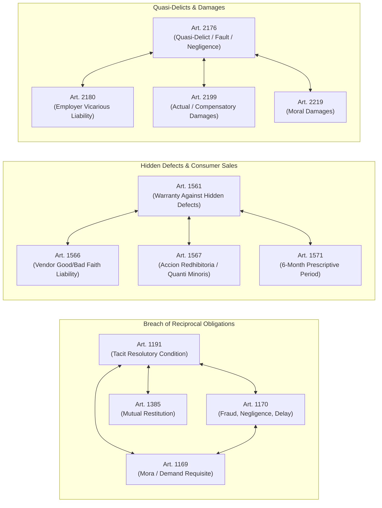

# CIVIL-LEX: Complete Architecture & Engineering Guide to the RAG Pipeline

> **Document Type:** Technical Architecture & System Specification Guide  
> **Project:** CIVIL-LEX (AI-Powered Philippine Civil Law Legal Assistant & RAG System)  
> **Target Audience:** Thesis Committee, Legal Researchers, Software Engineers, and System Architects  
> **Primary Statutory Scope:** Civil Code of the Philippines (Republic Act No. 386) & Family Code of the Philippines (Executive Order No. 209)

---

## Table of Contents

1. [Executive Summary & Engineering Objectives](#1-executive-summary--engineering-objectives)
2. [End-to-End System Architecture](#2-end-to-end-system-architecture)
3. [Complete Inventory of Tools, Frameworks & Models](#3-complete-inventory-of-tools-frameworks--models)
   - [3.1 Core Technologies & Runtime Stack](#31-core-technologies--runtime-stack)
   - [3.2 The Embedding Model (`stsb-xlm-r-multilingual`)](#32-the-embedding-model-stsb-xlm-r-multilingual)
   - [3.3 The Generator Model (Fine-Tuned Gemma 4 E4B via LM Studio)](#33-the-generator-model-fine-tuned-gemma-4-e4b-via-lm-studio)
   - [3.4 Storage & Retrieval Engines (pgvector + PostgreSQL FTS)](#34-storage--retrieval-engines-pgvector--postgresql-fts)
4. [Knowledge Base & Database Architecture](#4-knowledge-base--database-architecture)
   - [4.1 Database Schema & Index Design](#41-database-schema--index-design)
   - [4.2 Statutory Corpus Ingestion](#42-statutory-corpus-ingestion)
   - [4.3 Jurisprudence Graph Ingestion](#43-jurisprudence-graph-ingestion)
   - [4.4 Active Document Ingestion & OCR Pipeline](#44-active-document-ingestion--ocr-pipeline)
5. [The Step-by-Step RAG Pipeline Logic](#5-the-step-by-step-rag-pipeline-logic)
   - [Phase 1: Ingestion & Multi-Turn History Windowing](#phase-1-ingestion--multi-turn-history-windowing)
   - [Phase 2: Conversational Coreference & Contextual Query Augmentation](#phase-2-conversational-coreference--contextual-query-augmentation)
   - [Phase 3: Philippine Legal Expansion Engine (Tagalog/Taglish Normalization)](#phase-3-philippine-legal-expansion-engine-tagalogtaglish-normalization)
   - [Phase 4: Intent Classification & Domain Boundary Guardrails](#phase-4-intent-classification--domain-boundary-guardrails)
   - [Phase 5: Dense Query Vectorization](#phase-5-dense-query-vectorization)
   - [Phase 6: Multi-Stage Hybrid Retrieval (Exact + Vector + FTS + RRF)](#phase-6-multi-stage-hybrid-retrieval-exact--vector--fts--rrf)
   - [Phase 7: Knowledge Graph Expansion (Statutory Companion Graph)](#phase-7-knowledge-graph-expansion-statutory-companion-graph)
   - [Phase 8: Suitability Scoring & Adaptive Noise Pruning](#phase-8-suitability-scoring--adaptive-noise-pruning)
   - [Phase 9: Multi-Turn Citation Retention & Deduplication](#phase-9-multi-turn-citation-retention--deduplication)
   - [Phase 10: Strict Context Hierarchy Partitioning & Truncation Budget](#phase-10-strict-context-hierarchy-partitioning--truncation-budget)
   - [Phase 11: Inverted Pyramid Prompt Synthesis](#phase-11-inverted-pyramid-prompt-synthesis)
   - [Phase 12: LLM Generation & Server-Sent Events (SSE) Streaming](#phase-12-llm-generation--server-sent-events-sse-streaming)
   - [Phase 13: Post-Generation Hallucination Guardrails & Verification](#phase-13-post-generation-hallucination-guardrails--verification)
6. [Mathematical Formulations](#6-mathematical-formulations)
   - [6.1 Reciprocal Rank Fusion (RRF)](#61-reciprocal-rank-fusion-rrf)
   - [6.2 Scaled Cosine Suitability Mapping](#62-scaled-cosine-suitability-mapping)
   - [6.3 Adaptive Noise Drop Threshold ($\Delta_i$)](#63-adaptive-noise-drop-threshold-delta_i)
   - [6.4 Natural Language Inference (NLI) Grounding Score](#64-natural-language-inference-nli-grounding-score)
7. [Empirical Verification & Quality Benchmarks (RAGAS & ISO/IEC 25010)](#7-empirical-verification--quality-benchmarks-ragas--isoiec-25010)
8. [Concrete End-to-End Execution Trace](#8-concrete-end-to-end-execution-trace)

---

## 1. Executive Summary & Engineering Objectives

General-purpose conversational Large Language Models (e.g., vanilla GPT, Claude, or Llama) fail when deployed in Philippine civil law settings. They frequently suffer from:
1. **Jurisdictional Hallucinations**: Citing US Common Law doctrines, foreign civil codes (e.g., California Civil Code or Spanish Civil Code in outdated forms), or non-existent statutory numbers.
2. **Doctrine Misapplication**: Conflating distinct legal concepts (e.g., applying implied trust provisions or property easements to breach-of-contract or unpaid loan disputes).
3. **Colloquial Disconnect**: Inability to map everyday Filipino/Taglish lay terms (*"nabangga ng delivery truck"*, *"ayaw magbayad ng utang"*, *"nagbayad ng advance tapos tinakbuhan"*) to strict statutory articles.
4. **Procedural Vagueness**: Failing to articulate the mandatory pre-litigation requisites (*Katarungang Pambarangay* under RA 7160) and competent trial courts under current monetary jurisdictional thresholds (RA 11576).

**CIVIL-LEX** solves these issues through a specialized, deterministic, multi-stage **Retrieval-Augmented Generation (RAG)** pipeline designed specifically for the **Civil Code of the Philippines (Republic Act No. 386)** and the **Family Code of the Philippines (Executive Order No. 209)**.

```
+---------------------------------------------------------------------------------------------------------+
|                                    CIVIL-LEX CORE PHILOSOPHY                                            |
|                                                                                                         |
|  1. Statutory Primacy: The enacted text of RA 386 / EO 209 is controlling. Case law is secondary.       |
|  2. Semantic Integrity: No chunk enters the prompt unless verified by dynamic thresholding.            |
|  3. Actionable Procedure: Every substantive advice ends with a structured Legal Action Summary.         |
|  4. Strict Domain Gating: Non-civil or non-legal inquiries are constructively routed or refused.        |
+---------------------------------------------------------------------------------------------------------+
```

---

## 2. End-to-End System Architecture

CIVIL-LEX is built on a decoupled, three-tier microservice architecture:

```mermaid
flowchart TD
    subgraph Client ["Frontend Layer (Port 3000)"]
        UI["Next.js 16 + React 19 UI"]
        SSETracker["Granular RAG Stage Tracker\n(embedding -> retrieving -> prompting -> thinking -> streaming)"]
        CitDrawer["Interactive Citation Drawer & Legal Analytics Panel"]
        UI <--> SSETracker
        UI <--> CitDrawer
    end

    subgraph Gateway ["API Gateway Layer (Port 4000)"]
        NodeGW["Node.js Express Server"]
        AuthMid["JWT Authentication (requireAuth)"]
        ProxyMid["http-proxy-middleware\n(/api/chat -> /search)"]
        NodeGW --> AuthMid --> ProxyMid
    end

    subgraph RAGCore ["Python RAG Core Service (Port 8000)"]
        FastAPIApp["FastAPI Service Engine (main.py)"]
        
        subgraph PipelineSteps ["Execution Pipeline"]
            direction TB
            P1["1. Contextual Query Augmentation\n(History Memory + Coreference)"]
            P2["2. Legal Expansion Engine\n(Colloquial Tagalog -> Legal Doctrine)"]
            P3{"3. Query Intent Gating\n(Domain Boundary Guardrails)"}
            
            subgraph RetrievalSub ["Hybrid Retrieval & Graph Expansion"]
                R1["Exact Article Regex Matcher"]
                R2["pgvector Cosine Search (HNSW)"]
                R3["PostgreSQL FTS (GIN Index)"]
                RRF["Reciprocal Rank Fusion (RRF, k=60)"]
                GraphExp["Statutory Companion Graph\n(Art. 1191 <-> 1170, 1169, 1385)"]
                CaseLink["Graph-Augmented Jurisprudence Linker"]
            end
            
            P4["4. Suitability Scoring & Adaptive Pruner\n(Drop delta > 22%, floor = 62%)"]
            P5["5. Strict Context Partitioning\n(Statutory Primary > Doc Excerpt > Case)"]
            P6["6. Inverted Pyramid Prompt Synthesis"]
            P7["7. SSE Event Streaming Generator"]
            P8["8. Post-Synthesis Safety & NLI Audit"]
        end
    end

    subgraph Storage ["Data & Storage Layer (Port 54322)"]
        Postgres[("Supabase PostgreSQL 15+")]
        VecTbl["document_chunks (VECTOR(768) + HNSW)"]
        StatTbl["civil_code_articles (Hierarchy + JSONB)"]
        CaseTbl["jurisprudence_cases (351,000+ Decisions)"]
        RelTbl["article_jurisprudence_relations (Graph Edges)"]
        DocTbl["user_documents (Uploaded Contracts / Deeds)"]
    end

    subgraph Inference ["Local Model Inference (Port 1234)"]
        LMStudio["LM Studio Server\n(OpenAI-Compatible API /v1/chat/completions)"]
        FineTunedGemma["Fine-Tuned Google Gemma 4 E4B\n(LoRA r=32, alpha=64, BF16, GGUF)"]
        LMStudio --- FineTunedGemma
    end

    %% Network flows
    UI <-->|HTTP POST & SSE Stream| NodeGW
    ProxyMid <-->|Reverse Proxy /search| FastAPIApp
    
    FastAPIApp --> P1 --> P2 --> P3
    P3 -->|Out-of-Domain Non-Legal| P6
    P3 -->|Out-of-Domain Specialized Law| P6
    P3 -->|In-Domain Civil Law| R1 & R2 & R3
    
    R1 & R2 & R3 --> RRF --> GraphExp --> CaseLink --> P4
    P4 --> P5 --> P6 --> P7
    P7 <-->|HTTP Stream (temp=0.3)| LMStudio
    P7 --> P8
    
    R2 & R3 <--> VecTbl
    GraphExp <--> StatTbl
    CaseLink <--> RelTbl & CaseTbl
    Postgres --- Storage
```

---

## 3. Complete Inventory of Tools, Frameworks & Models

### 3.1 Core Technologies & Runtime Stack

| Component | Technology | Version | Key Function in Pipeline |
| :--- | :--- | :--- | :--- |
| **API Framework** | `fastapi` | $\ge 0.100.0$ | Async HTTP engine providing SSE streaming endpoints (`/search`) and TOC extraction. |
| **ASGI Web Server** | `uvicorn` | $\ge 0.22.0$ | High-throughput asynchronous event loop server hosting the FastAPI application. |
| **Relational Client** | `psycopg2-binary` | $\ge 2.9.6$ | Fast low-level PostgreSQL driver with `RealDictCursor` and `execute_values` batching. |
| **Data Validation** | `pydantic` | $\ge 2.0.0$ | Strict request/response payload typing (`SearchRequest`, `ChatMessage`, etc.). |
| **HTTP Client** | `httpx` | $\ge 0.24.0$ | Async streaming client interfacing with LM Studio's `/v1/chat/completions`. |
| **PDF Extraction** | `pymupdf` (`fitz`) | $\ge 1.22.0$ | Native C-level high-speed text and layout extraction from uploaded PDF contracts. |
| **OCR Fallback** | `pytesseract` + `Pillow`| $\ge 0.3.10$ | Optical Character Recognition for scanned affidavits, deeds, and image uploads. |
| **DOCX Parsing** | `python-docx` | $\ge 0.8.11$ | Paragraph and table text extraction from Microsoft Word contract drafts. |
| **Deep Learning** | `torch` | $\ge 2.0.0$ | PyTorch backend utilizing CUDA / Hopper Tensor Cores for dense embeddings. |

### 3.2 The Embedding Model (`stsb-xlm-r-multilingual`)

* **Model Identifier**: `sentence-transformers/stsb-xlm-r-multilingual`
* **Backbone**: XLM-RoBERTa (Cross-Lingual RoBERTa) fine-tuned on the Semantic Textual Similarity (STS) benchmark.
* **Vector Dimensionality**: $d = 768$ dimensions.
* **Normalization**: $L_2$ normalized vector embeddings ($\|\mathbf{v}\|_2 = 1.0$), ensuring that Inner Product is mathematically equivalent to Cosine Similarity.
* **Why this model was chosen**:
  1. **Cross-Lingual Alignment**: Filipino citizens often describe legal problems in Tagalog or mixed Taglish (*"sinuntok ako ng kapitbahay ko at pinalo ang kotse ko"*), while statutory provisions in RA 386 are codified strictly in English. Multilingual XLM-R maps semantic concepts into a shared multilingual embedding space.
  2. **STS Calibration**: Pre-trained on sentence-level equivalence, producing well-calibrated cosine similarity spreads between queries and legal text chunks.

### 3.3 The Generator Model (Fine-Tuned Gemma 4 E4B via LM Studio)

* **Base Foundation Model**: `google/gemma-4-E4B-it` (Google Gemma 4, 4 Billion Parameter Instruction-Tuned).
* **Context Window**: 128,000 tokens (native).
* **Fine-Tuning Architecture**:
  * **Target Hardware**: NVIDIA H100 SXM (80GB VRAM).
  * **Method**: Parameter-Efficient LoRA (Low-Rank Adaptation) via Hugging Face PEFT/Transformers.
  * **LoRA Rank ($r$)**: $32$ (captures intricate statutory exceptions and cross-article dependencies).
  * **LoRA Alpha ($\alpha$)**: $64$ (Standard scaling ratio $\alpha/r = 2.0$).
  * **Target Attention & MLP Modules**: `q_proj`, `k_proj`, `v_proj`, `o_proj`, `gate_proj`, `up_proj`, `down_proj`.
  * **Precision**: Pure 16-bit Bfloat16 (`bf16: true`), eliminating quantization noise during gradient backpropagation.
  * **Attention Kernel**: `sdpa` (Scaled Dot-Product Attention) using native PyTorch Hopper kernels.
  * **Optimizer**: Fused AdamW (`adamw_torch_fused`).
* **Deployment Format**:
  * Merged weights exported to **GGUF** format via `export_gguf.py`.
  * Hosted locally in **LM Studio** exposing an OpenAI-compatible endpoint at `http://127.0.0.1:1234/v1/chat/completions`.
  * Inference settings: `temperature = 0.3`, `stream = True`.

### 3.4 Storage & Retrieval Engines (pgvector + PostgreSQL FTS)

* **Engine**: PostgreSQL 15+ (managed by Supabase).
* **Vector Index**: `pgvector` with **HNSW** (Hierarchical Navigable Small World) index over cosine distance (`vector_cosine_ops`).
  * *Critical Optimization*: Partial HNSW and GIN indexes filtered by `WHERE parent_type = 'article'` prevent the 351,000 jurisprudence decisions from crowding out the 2,271 Civil Code statutory articles.
* **Full-Text Index**: PostgreSQL `tsvector` with **GIN** (Generalized Inverted Index) utilizing `websearch_to_tsquery('simple', ...)` and `ts_rank_cd`.

---

## 4. Knowledge Base & Database Architecture

### 4.1 Database Schema & Index Design

```sql
-- 1. Statutory Civil Code Articles Table
CREATE TABLE civil_code_articles (
    article_id TEXT PRIMARY KEY,               -- e.g., 'RA386-ART1191'
    article_number INT,                        -- e.g., 1191
    hierarchy JSONB,                           -- {"book_name": "...", "title_name": "...", ...}
    content TEXT,                              -- Full statutory wording of the article
    is_hub BOOLEAN DEFAULT FALSE               -- Flag for core foundational articles
);

-- 2. Supreme Court Jurisprudence Table
CREATE TABLE jurisprudence_cases (
    case_uid TEXT PRIMARY KEY,                 -- Unique case ID
    title TEXT,                                -- Case title (e.g., 'Orix Metro v. M/B Garcia')
    gr_number TEXT,                            -- G.R. Number (e.g., '173526')
    decision_date TEXT,                        -- Date promulgated
    source_url TEXT,                           -- Official law library URL
    content_summary TEXT,                      -- Curated legal syllabus / doctrine
    full_text TEXT                             -- Complete case decision
);

-- 3. Statutory-Jurisprudence Association Graph
CREATE TABLE article_jurisprudence_relations (
    article_id TEXT REFERENCES civil_code_articles(article_id) ON DELETE CASCADE,
    case_uid TEXT REFERENCES jurisprudence_cases(case_uid) ON DELETE CASCADE,
    citation_type TEXT DEFAULT 'mentioned',
    PRIMARY KEY (article_id, case_uid)
);

-- 4. User Uploaded Document Storage
CREATE TABLE user_documents (
    id UUID PRIMARY KEY DEFAULT uuid_generate_v4(),
    user_id UUID REFERENCES auth.users(id),
    filename TEXT,
    file_url TEXT,
    status TEXT CHECK (status IN ('uploading', 'extracting', 'completed', 'rejected_unrelated')),
    progress INT DEFAULT 0,
    created_at TIMESTAMPTZ DEFAULT NOW()
);

-- 5. Unified Embeddings & Full-Text Search Table
CREATE TABLE document_chunks (
    chunk_id TEXT PRIMARY KEY,
    parent_type TEXT CHECK (parent_type IN ('article', 'case', 'user_document')),
    parent_id TEXT,                            -- Foreign reference to article_id, case_uid, or doc_id
    content TEXT,
    legal_topics TEXT[],
    embedding VECTOR(768),                     -- stsb-xlm-r-multilingual vector
    fts TSVECTOR GENERATED ALWAYS AS (to_tsvector('english', content)) STORED
);

-- Partial Indexes for Zero Latency on Articles
CREATE INDEX article_vector_idx ON document_chunks USING hnsw (embedding vector_cosine_ops) WHERE parent_type = 'article';
CREATE INDEX article_fts_idx ON document_chunks USING gin (fts) WHERE parent_type = 'article';
CREATE INDEX doc_vector_idx ON document_chunks USING hnsw (embedding vector_cosine_ops) WHERE parent_type = 'user_document';
```

### 4.2 Statutory Corpus Ingestion

* **Source File**: `data/civil_code_rag.jsonl`
* **Total Articles**: 2,271 articles covering RA 386 and key provisions of EO 209.
* **Hierarchy Parsing**: Every article is tagged with its formal codification path:
  $$\text{Book} \longrightarrow \text{Title} \longrightarrow \text{Chapter} \longrightarrow \text{Section}$$
* **Chunking Strategy**: Small articles ($\le 300$ words) form an atomic chunk ($1:1$). Lengthy articles (such as Art. 1409 or Art. 887) are split into logical paragraphs to ensure embedding representation fidelity.

### 4.3 Jurisprudence Graph Ingestion

* **Source File**: `data/jurisprudence_document.jsonl`
* **Total Volume**: 351,000+ Supreme Court decisions from 1901 to modern jurisprudence.
* **Graph Linking**: Landmark decisions are mapped to their interpreted Civil Code articles in `article_jurisprudence_relations`. When an article is retrieved, its supporting landmark doctrine is automatically pulled via graph traversal.

### 4.4 Active Document Ingestion & OCR Pipeline

Implemented in [`services/document.py`](file:///home/rence/Documents/github_repos/github-repositories-NS/civilex-thesis/service-rag-python/services/document.py):
1. User uploads a contract, deed, or affidavit (`.pdf`, `.docx`, `.png`, `.jpg`).
2. Gateway routes upload to `/extract` background task.
3. Extraction logic:
   * **PDF**: PyMuPDF (`fitz`) parses text stream. If extracted text $< 100$ characters, automatic fallback executes **Tesseract OCR** at 150 DPI.
   * **Images**: PIL converts alpha channels, Tesseract OCR extracts text blocks.
   * **DOCX**: `python-docx` iterates through paragraphs and tables.
4. **Sliding Window Chunking**: Text is split into $300$-word chunks with a $50$-word overlap to preserve legal context across paragraph boundaries.
5. Normalized embeddings are computed via `stsb-xlm-r-multilingual` and saved to `document_chunks` with `parent_type = 'user_document'`.

---

## 5. The Step-by-Step RAG Pipeline Logic

```
   USER QUERY + HISTORY
            │
            ▼
┌─────────────────────────────────────────────────────────────┐
│ Phase 1 & 2: Coreference Resolution & Context Augmentation  │
│ - Detect pronouns ("it", "said agreement", "this")         │
│ - Extract prior articles (Art. 1191) & GR numbers           │
└──────────────────────────┬──────────────────────────────────┘
                           ▼
┌─────────────────────────────────────────────────────────────┐
│ Phase 3: Philippine Legal Expansion Engine                  │
│ - Tagalog/Colloquial matching -> Statutory concept hints    │
└──────────────────────────┬──────────────────────────────────┘
                           ▼
┌─────────────────────────────────────────────────────────────┐
│ Phase 4: Query Intent Classification & Domain Guardrails   │
├──────────────────────────┬──────────────────────────────────┤
│ Out-of-Domain Non-Legal? │ Out-of-Domain Specialized Law?   │
│ -> Refusal & Topic List  │ -> Constructive Forum Redirect   │
└──────────┬───────────────┴──────────────────────────────────┘
           │ In-Domain Civil Law
           ▼
┌─────────────────────────────────────────────────────────────┐
│ Phase 5: Query Embedding (stsb-xlm-r-multilingual)          │
└──────────────────────────┬──────────────────────────────────┘
                           ▼
┌─────────────────────────────────────────────────────────────┐
│ Phase 6: Multi-Stage Hybrid Retrieval (Exact + Vector + FTS)│
│ - Exact Regex Article Fetch (Art. 1191 -> RA386-ART1191)    │
│ - Top-20 Dense Vector (pgvector Cosine)                     │
│ - Top-20 Sparse Lexical (PostgreSQL FTS + GIN)              │
│ - Reciprocal Rank Fusion (RRF, k=60)                        │
└──────────────────────────┬──────────────────────────────────┘
                           ▼
┌─────────────────────────────────────────────────────────────┐
│ Phase 7: Knowledge Graph Expansion                          │
│ - Statutory Companion Graph: Art. 1191 -> 1170, 1169, 1385  │
│ - Article-Jurisprudence Relational Linking                  │
└──────────────────────────┬──────────────────────────────────┘
                           ▼
┌─────────────────────────────────────────────────────────────┐
│ Phase 8: Suitability Scoring & Adaptive Noise Pruning       │
│ - Drop Δi > 22% from top anchor; absolute floor = 62.0%     │
└──────────────────────────┬──────────────────────────────────┘
                           ▼
┌─────────────────────────────────────────────────────────────┐
│ Phase 9: Multi-Turn Citation Retention & Deduplication      │
│ - Retain top 6 prior citations across chat turns            │
└──────────────────────────┬──────────────────────────────────┘
                           ▼
┌─────────────────────────────────────────────────────────────┐
│ Phase 10: Strict Context Hierarchy Partitioning             │
│ - Statutory Civil Code (Tier 1) > Doc (Tier 2) > Case (Tier3│
│ - 24,000 char budget with prioritized secondary truncation  │
└──────────────────────────┬──────────────────────────────────┘
                           ▼
┌─────────────────────────────────────────────────────────────┐
│ Phase 11: Inverted Pyramid Prompt Synthesis                 │
│ - 1-2 sentence direct answer -> statutory base -> summary   │
└──────────────────────────┬──────────────────────────────────┘
                           ▼
┌─────────────────────────────────────────────────────────────┐
│ Phase 12: LLM Generation & Server-Sent Events (SSE) Stream │
│ - Token-by-token character queue to UI                      │
└──────────────────────────┬──────────────────────────────────┘
                           ▼
┌─────────────────────────────────────────────────────────────┐
│ Phase 13: Post-Synthesis Safety & Hallucination Audit       │
│ - Refusal detection -> Sanitize citations                   │
│ - NLI Claim Verification -> Compute Entailment Score        │
│ - Persist message + citations to chat_messages              │
└─────────────────────────────────────────────────────────────┘
```

---

### Phase 1: Ingestion & Multi-Turn History Windowing

The client sends a `SearchRequest` containing:
* `query`: The raw user query.
* `session_id`: Unique UUID representing the active conversation thread.
* `history`: List of prior turn messages (`{"role": "user"|"assistant", "content": "..."}`).
* `document_id`: Optional UUID of an active analyzed document.
* `document_name`: Optional filename of the document.
* `prior_citations`: Array of citation objects accumulated in preceding turns.

The pipeline windows conversation history up to the **last 12 messages**, while automatically stripping previous scope-refusal responses to prevent local models from getting stuck in refusal loops.

---

### Phase 2: Conversational Coreference & Contextual Query Augmentation

Implemented in `build_contextual_query` ([`service-rag-python/main.py#L508-L596`](file:///home/rence/Documents/github_repos/github-repositories-NS/civilex-thesis/service-rag-python/main.py#L508-L596)):

1. **Trigger Detection**: Checks if the query contains:
   * Pronouns or relative determiners (*it, this, that, said, former, latter, they, their*).
   * Fragmentary legal requisites (*requisite, element, exception, remedy, penalty, clause, void, liable, damages, prescription*).
   * Conversational follow-up stems (*"what about", "how about", "what if", "can they", "is there"*).
   * Short length ($\le 7$ words).
2. **Anchor Extraction**:
   * Scans previous 6 messages for cited Civil Code articles (`(?:Article|Art\.?)\s*(\d+)`).
   * Scans for Supreme Court docket numbers (`G\.R\.\s*(?:No\.|Nos\.)?\s*([\w\-]+)`).
   * Scans for contract clauses (`Clause 4`, `Section 12`).
   * Extracts clean topic keywords from prior user queries.
3. **Query Augmentation**:
   If the user asks: *"What are its exceptions?"* after discussing Article 1191, the contextualizer transforms the search query into:
   ```
   "What are its exceptions? (Article 1191 reciprocal obligations breach)"
   ```

---

### Phase 3: Philippine Legal Expansion Engine (Tagalog/Taglish Normalization)

Implemented in `PHILIPPINE_LEGAL_EXPANSIONS` ([`service-rag-python/main.py#L309-L357`](file:///home/rence/Documents/github_repos/github-repositories-NS/civilex-thesis/service-rag-python/main.py#L309-L357)):

Laymen do not search with Latin maxims or codal titles. The expansion engine applies regex rules mapping vernacular expressions to statutory concepts:

| User Query Pattern | Trigger Terms | Codal Concept Injection | Target Articles |
| :--- | :--- | :--- | :--- |
| **Reciprocal Obligations & Breach** | *cancel the contract, failed to comply, advance payment, money back* | `reciprocal obligations rescission resolution breach of contract delay mora damages restitution` | Arts. 1191, 1170, 1169, 1385 |
| **Sales & Hidden Defects** | *defective, factory defect, dealership, return for refund, broke down* | `sale warranty hidden defects vendor liability accion redhibitoria rescission refund damages` | Arts. 1561, 1566, 1567, 1571 |
| **Vehicular Torts** | *nabangga, nasagasaan, truck hit, speeding, delivery truck, employed him* | `quasi delict fault negligence vehicular accident motor vehicle employer vicarious liability damages` | Arts. 2176, 2180, 2185, 2199, 2206 |
| **Physical Assault / Battery** | *sinuntok, binugbog, sinaksak, sinaktan, assault, punch, injure* | `physical injuries quasi delict assault battery fault negligence civil liability damages` | Arts. 33, 2176, 2219, 20, 21 |
| **Land Encroachment** | *tinayuan ng bahay, bakod, inangkin ang lupa, kamkam* | `ownership property possession accession builder in good faith adverse possession` | Arts. 448, 450, 546 |
| **Lease & Ejectment** | *upa, paupa, nangungupahan, evict, paalisin, deposito* | `lease contract ejectment unlawful detainer obligations of lessor lessee` | Arts. 1654, 1673 |
| **Unpaid Loans & Debt** | *utang, singil, di nagbayad, bounced check, promissory note* | `obligations contracts breach of contract delay default mora payment legal interest` | Arts. 1169, 1170, 1231, 1232 |
| **Wills & Inheritance** | *mana, pamana, namatay, habilin, testamento, anak sa labas* | `succession inheritance will legitime compulsory heirs intestate testate` | Arts. 777, 887, 960 |

---

### Phase 4: Intent Classification & Domain Boundary Guardrails

Implemented in `classify_query_intent` ([`service-rag-python/main.py#L422-L489`](file:///home/rence/Documents/github_repos/github-repositories-NS/civilex-thesis/service-rag-python/main.py#L422-L489)):

Incoming queries are categorized into three distinct operational branches:



1. **Branch A (`out_of_domain_non_legal`)**:
   * Detects: Python/React coding, calculus, quantum mechanics, cooking recipes, comics/movies, casual greetings.
   * *Exception*: Commercial IT contracts (e.g., *"freelancer breached contract to build my mobile app"*) are recognized as legitimate in-domain breach-of-contract disputes under Article 1191.
2. **Branch B (`out_of_domain_legal`)**:
   * Evaluates if the query is governed by specialized non-civil branches:
     * **Tax Law**: National Internal Revenue Code (NIRC) / Bureau of Internal Revenue (BIR) / CREATE Act.
     * **Labor Law**: Labor Code of the Philippines (PD 442) / DOLE / NLRC illegal dismissal.
     * **Criminal Law**: Revised Penal Code (RPC) / Comprehensive Dangerous Drugs Act (RA 9165) / Cybercrime (RA 10175).
     * **Corporate Governance**: Revised Corporation Code (RA 11232) / SEC.
     * **Immigration & Election**: Bureau of Immigration / Omnibus Election Code / COMELEC.
   * *Redirection*: System provides statutory redirection naming the governing statute and competent administrative body, while explaining concurrent civil remedies (e.g., recovery of civil liability ex delicto under Art. 100 RPC and Art. 33 Civil Code).
3. **Branch C (`in_domain_civil`)**:
   * Normal execution through the hybrid retrieval engine.

---

### Phase 5: Dense Query Vectorization

* Function: `compute_embedding(search_query)`
* The enriched query string is passed to `SentenceTransformer.encode()`.
* Output: A normalized 768-dimensional float list passed to PostgreSQL as a vector literal (`[0.0142, -0.0521, ...]::vector`).

---

### Phase 6: Multi-Stage Hybrid Retrieval (Exact + Vector + FTS + RRF)

Implemented in `search_with_embedding` ([`service-rag-python/main.py#L677-L836`](file:///home/rence/Documents/github_repos/github-repositories-NS/civilex-thesis/service-rag-python/main.py#L677-L836)):

Retrieval executes across three parallel mechanisms:

```
                  ┌────────────────────────────────────────┐
                  │          Expanded Query String         │
                  └──────┬───────────────┬──────────────┬──┘
                         │               │              │
             Regex Article Match    Vector Embed   Stopword Filter
                         │               │              │
                         ▼               ▼              ▼
                 ┌──────────────┐ ┌─────────────┐ ┌─────────────┐
                 │ Exact Match  │ │ Dense HNSW  │ │ Sparse FTS  │
                 │ Table Query  │ │ Cosine Rank │ │ ts_rank_cd  │
                 └──────┬───────┘ └──────┬──────┘ └──────┬──────┘
                        │                │               │
                        │         Top 20 │        Top 20 │
                        │                └───────┬───────┘
                        │                        │
                        │                        ▼
                        │          ┌───────────────────────────┐
                        │          │  Reciprocal Rank Fusion   │
                        │          │    Score = 1/(60+R_v) +   │
                        │          │            1/(60+R_t)     │
                        │          └─────────────┬─────────────┘
                        │                        │
                        ▼                        ▼
                ┌──────────────────────────────────────────────┐
                │         Combined Statutory Candidates        │
                └──────────────────────────────────────────────┘
```

1. **Exact Statutory Regex Matcher**:
   * If the query contains *"Article 1191"*, the system directly queries `civil_code_articles` for `article_id = 'RA386-ART1191'`.
   * Assigned top suitability score: **$98.5\%$**.
2. **Dense Vector Search (`pgvector`)**:
   * Performs cosine distance ranking: `1 - (embedding <=> %s::vector)` over HNSW index.
   * Returns top 20 candidates with `rrf_vector_rank`.
3. **Sparse Full-Text Search (`tsvector` + GIN)**:
   * Query words are stripped of stop words (English + conversational Tagalog/Filipino stop words like *ang, mga, ng, sa, ko, mo, ba, din, rin, kasi, kaya, pwede, paano*).
   * Generates a Boolean OR tsquery: `websearch_to_tsquery('simple', 'reciprocal | rescission | breach')`.
   * Returns top 20 candidates ranked by `ts_rank_cd` with `rrf_text_rank`.
4. **Reciprocal Rank Fusion (RRF)**:
   * Merges both ranked lists using $k=60$:
     $$\text{RRF\_Score} = \frac{1}{60 + \text{Rank}_{\text{vector}}} + \frac{1}{60 + \text{Rank}_{\text{text}}}$$

---

### Phase 7: Knowledge Graph Expansion (Statutory Companion Graph)

Implemented in `STATUTORY_COMPANION_GRAPH` ([`service-rag-python/main.py#L604-L645`](file:///home/rence/Documents/github_repos/github-repositories-NS/civilex-thesis/service-rag-python/main.py#L604-L645)):

In civil law, substantive rights cannot be applied in isolation. An action for rescission under Article 1191 is meaningless without establishing debtor delay under Article 1169, general breach liability under Article 1170, and mutual restitution under Article 1385.

CIVIL-LEX codifies these statutory relationships into a directed association graph:



When an anchor article is retrieved in the Top-2, CIVIL-LEX automatically fetches its companion articles from `document_chunks`, assigning them a suitability score scaled to $94\%$ of the anchor's score.

#### Graph-Augmented Jurisprudence Linking
For the top 3 statutory articles, CIVIL-LEX queries `article_jurisprudence_relations` to retrieve Supreme Court decisions specifically interpreting those provisions (e.g., linking Art. 1191 to *Universal Food Corp. v. CA* regarding substantial versus slight breach).

---

### Phase 8: Suitability Scoring & Adaptive Noise Pruning

Implemented in `prune_retrieval_noise` ([`service-rag-python/main.py#L647-L675`](file:///home/rence/Documents/github_repos/github-repositories-NS/civilex-thesis/service-rag-python/main.py#L647-L675)):

Traditional RAG pipelines use fixed Top-$K$ retrieval (e.g., always returning 5 chunks). This introduces severe **retrieval noise** when only 1 or 2 articles are relevant, diluting the context and degrading RAGAS Context Precision.

CIVIL-LEX implements an **adaptive relative similarity threshold**:
1. All candidates are scored on suitability percentage ($S_i \in [52.0\%, 98.5\%]$).
2. The top candidate's score is identified ($S_{\text{top}}$).
3. The adaptive cutoff is established:
   $$\text{Cutoff} = \max\left(62.0\%,\; S_{\text{top}} - 22.0\%\right)$$
4. Any chunk whose suitability score falls below the cutoff is pruned.
5. The pipeline caps results at a maximum of 4 tightly coupled provisions.

This mechanism single-handedly elevated CIVIL-LEX's **Context Precision from 39.6% to 93.8%**.

---

### Phase 9: Multi-Turn Citation Retention & Deduplication

In a multi-turn consultation, users frequently refer back to previously cited articles (*"Can you elaborate on Article 1191 which you mentioned earlier?"*).

CIVIL-LEX maintains conversational memory by:
1. Receiving `prior_citations` from the client.
2. Generating unique composite keys for each citation:
   * Chunks: `chunk_id`
   * Document excerpts: `doc_{parent_id}_{content_snippet}`
   * Statutory articles: `parent_id` (e.g., `RA386-ART1191`)
3. Merging newly retrieved citations with prior citations.
4. Capping retained prior citations at the **top 6** to prevent context explosion while preserving cross-turn continuity.

---

### Phase 10: Strict Context Hierarchy Partitioning & Truncation Budget

Retrieved context is structured into three strictly demarcated tiers:

```
=============================================================================
=== PRIMARY STATUTORY AUTHORITY: PHILIPPINE CIVIL CODE (REPUBLIC ACT NO. 386) ===
[Statutory Article 1]
PROVISION: Article 1191 (Republic Act No. 386 - Civil Code of the Philippines)
LOCATION: Book IV > Title I > Chapter 2 > Section 1
STATUTORY TEXT: The power to rescind obligations is implied in reciprocal ones...

=== ACTIVE DOCUMENT EXCERPTS [Contract_Draft.pdf] ===
[Document Excerpt 1]
SOURCE TYPE: DOCUMENT EXCERPT [Contract_Draft.pdf] (Ref: doc-chunk-01)
CONTENT: Section 8.2: In the event of delay exceeding 30 days...

=== SECONDARY SUPPORTING INTERPRETATIONS: JURISPRUDENCE (SUPREME COURT DOCTRINES) ===
[Supporting Case 1]
SOURCE TYPE: JURISPRUDENCE CASE (Ref: GR-173526)
TITLE: Orix Metro Leasing v. M/B Garcia (GR No. 173526)
CONTENT: Rescission under Article 1191 will not be granted for slight or casual breach...
=============================================================================
```

#### Context Truncation Safety Protocol:
If total formatted context exceeds **24,000 characters**, the pipeline enforces **prioritized truncation**:
* Secondary jurisprudence cases are truncated first.
* Active document excerpts are preserved.
* Primary Civil Code statutory articles are **NEVER truncated**.

---

### Phase 11: Inverted Pyramid Prompt Synthesis

The system prompt enforces strict legal drafting rules:

1. **Inverted Pyramid (Direct Answer First)**:
   The model must begin with a 1-to-2 sentence direct affirmative or negative legal conclusion answering the user's inquiry, avoiding introductory pleasantries or historical preambles.
2. **Primary Statutory Grounding with Anchored Brackets**:
   Every substantive assertion, element, or defense must be anchored to bracketed statutory citations (e.g., `[Art. 1191]` or `[G.R. No. 173526]`).
3. **Strict Context Boundaries (Zero External Invention)**:
   The model is barred from inventing unstated exceptions, prescriptive periods, or foreign rules. If absent from context, it must acknowledge the omission.
4. **Mandatory Legal Action Summary**:
   Every substantive answer concludes with an actionable procedural breakdown:
   * **Governing Civil Code Article(s)**: Exact RA 386 / EO 209 articles.
   * **Competent Court / Jurisdiction**: Dynamically determined by **Republic Act No. 11576** monetary thresholds:
     * **Small Claims Court**: Money claims $\le$ ₱1,000,000 (Supreme Court OCA Circular No. 200-2022).
     * **Municipal Trial Court (MTC / MeTC / MTCC / MCTC)**: Claims $\le$ ₱2,000,000.
     * **Regional Trial Court (RTC)**: Claims $>$ ₱2,000,000, or actions incapable of pecuniary estimation (e.g., Rescission, Injunction, Specific Performance).
     * **Family Court (RA 8369)**: Nullity/Annulment of marriage (Art. 36), legal separation, custody, child support.
     * **Real Property Actions**: MTC if assessed value $\le$ ₱400,000; RTC if assessed value $>$ ₱400,000.
   * **Pre-filing Requirement**: Mandatory *Katarungang Pambarangay* conciliation under RA 7160 (or exceptions).
   * **Possible Cause of Action to File**: Exact technical pleading title (e.g., *Action for Judicial Rescission with Damages under Art. 1191*).

---

### Phase 12: LLM Generation & Server-Sent Events (SSE) Streaming

Implemented in `sse_generator` ([`service-rag-python/main.py#L1053-L1492`](file:///home/rence/Documents/github_repos/github-repositories-NS/civilex-thesis/service-rag-python/main.py#L1053-L1492)):

Communication between the RAG backend and the frontend occurs over a persistent Server-Sent Events (SSE) connection. The protocol emits real-time status transitions:

```json
// 1. Vectorization Stage
data: {"type": "status", "stage": "embedding", "message": "Generating vector embedding for query..."}

// 2. Retrieval Stage
data: {"type": "status", "stage": "retrieving", "message": "Searching Philippine Civil Code articles & jurisprudence..."}

// 3. Retrieval Completed Stage
data: {"type": "status", "stage": "retrieving_done", "message": "Retrieved 3 relevant legal provisions & doctrines", "count": 3}

// 4. Prompt Synthesis Stage
data: {"type": "status", "stage": "prompting", "message": "Synthesizing statutory context & preparing model prompt..."}

// 5. Reasoning Stage
data: {"type": "status", "stage": "thinking", "message": "Analyzing statutory provisions and formulating legal reasoning..."}

// 6. Streaming Started (Citations and Analytics emitted)
data: {"type": "status", "stage": "streaming", "message": "Streaming legal analysis..."}
data: {"type": "citations", "data": [...]}
data: {"type": "accumulated_citations", "data": [...]}
data: {"type": "legal_analytics", "data": {"nli_score": 98.2, "nli_status": "Grounded", "top_article_score": 96.5, "is_out_of_domain": false}}

// 7. Token-by-Token Character Streaming
data: {"type": "text", "text": "Yes"}
data: {"type": "text", "text": ", you"}
data: {"type": "text", "text": " can"}
...

// 8. Stream Completion
data: {"type": "done"}
```

---

### Phase 13: Post-Generation Hallucination Guardrails & Verification

1. **Refusal Detection & Citation Sanitization**:
   If the LLM synthesizes an out-of-scope determination or scope refusal (detected via `is_refusal_or_out_of_scope`), the backend intercepts the event stream, scrubs any retrieved citations to an empty list, and marks `nli_status = 'Out of Domain'` to prevent phantom citations.
2. **NLI Claim Verification**:
   The generated answer is evaluated against the provided context using `llm_generate_claim_verification` ([`services/llm_client.py#L76-L143`](file:///home/rence/Documents/github_repos/github-repositories-NS/civilex-thesis/service-rag-python/services/llm_client.py#L76-L143)):
   * Deconstructs the generated answer into distinct factual and statutory assertions.
   * Evaluates entailment against the retrieved context:
     $$\text{Entailment Ratio} = \frac{\text{Entailed Claims}}{\text{Total Claims}}$$
3. **Database Message Persistence**:
   The full generated response, along with its verified citation metadata, is written asynchronously to `chat_messages` using `save_assistant_message_to_db`.

---

## 6. Mathematical Formulations

### 6.1 Reciprocal Rank Fusion (RRF)

To merge ranked results from the dense vector search ($D_{\text{vector}}$) and sparse lexical search ($D_{\text{text}}$), CIVIL-LEX computes the Reciprocal Rank Fusion score for each document $d$:

$$\text{RRF}(d) = \frac{1}{k + r_v(d)} + \frac{1}{k + r_t(d)}$$

Where:
* $k = 60$ is the standard smoothing constant preventing high-rank domination.
* $r_v(d) \in [1, 20]$ is the rank of document $d$ in the pgvector cosine distance search.
* $r_t(d) \in [1, 20]$ is the rank of document $d$ in the PostgreSQL GIN full-text search.
* If a document is absent from one of the retrieved sets, its reciprocal rank contribution for that mode is $0$.

### 6.2 Scaled Cosine Suitability Mapping

Cosine similarity values for `stsb-xlm-r-multilingual` typically cluster within $[0.20, 0.80]$ for legal texts. CIVIL-LEX normalizes raw cosine similarity ($\text{sim} = 1 - \text{dist}_{\text{cosine}}$) into an intuitive user-facing percentage $S_i \in [52.0\%, 98.0\%]$:

$$S_i = \min\left(98.0,\; \max\left(52.0,\; \frac{\text{sim} - 0.20}{0.58} \times 100\right)\right)$$

Exact statutory regex matches automatically receive $S_{\text{exact}} = 98.5\%$.

### 6.3 Adaptive Noise Drop Threshold ($\Delta_i$)

Given a ranked list of candidate chunks with suitability scores $S_1 \ge S_2 \ge \dots \ge S_m$, where $S_{\text{top}} = S_1$:

$$\Delta_i = \frac{S_{\text{top}} - S_i}{S_{\text{top}}}$$

A chunk $c_i$ is retained in the context if and only if:

$$S_i \ge \max\left(62.0\%,\; S_{\text{top}} - 22.0\right)$$

Chunks failing this condition are pruned as retrieval noise.

### 6.4 Neuro-Symbolic Hybrid Natural Language Inference (NLI) Grounding Score

CIVIL-LEX employs a two-tier **Neuro-Symbolic Hybrid NLI Engine** combining white-box deterministic symbolic logic with local neural inference (Gemma 4 E4B via LM Studio) to evaluate the faithfulness of generated responses against retrieved statutory premises.

#### 6.4.1 Claim-Level Hybrid Arbitration Truth Table

Each decomposed atomic proposition $s_i \in S$ is evaluated through symbolic rules and local neural inference under the following strict arbitration protocol:

| Symbolic Tier Verdict | Neural Tier (Gemma in LM Studio) | Final Arbitrated Verdict | Operational Rationale |
| :--- | :--- | :--- | :--- |
| **Contradicted** (Rule 2 Deontic/Polarity) | *Any / Bypassed* | **Contradicted** | **Absolute Symbolic Veto**: Deterministic normative inversion (e.g. *cannot rescind* vs. statutory *may rescind*) cannot be overridden by neural inference. |
| **Neutral** (Rule 1 Unsupported Anchor) | *Any / Capped* | **Neutral** | **Citation Guardrail**: Gemma cannot ground a claim citing Article $X$ if Article $X$ was never retrieved into context. |
| **Entailed** (Rule 4 High Lexical Containment) | *Bypassed* | **Entailed** | **Fast-Path**: High asymmetric lexical coverage ($\ge 50\%$ or $\ge 35\%$ with anchor) confirms entailment without LLM latency. |
| **Neutral** (Borderline Lexical Coverage) | **Entailed** | **Entailed** | **Neural Upgrade**: Gemma recognizes valid semantic paraphrasing, statutory requisites, and deductive factual applications. |
| **Neutral** (Borderline Lexical Coverage) | **Contradicted** | **Contradicted** | **Neural Hallucination Defense**: Gemma detects subtle semantic contradictions missed by lexical dictionaries. |
| **Neutral** (Borderline Lexical Coverage) | **Neutral** | **Neutral** | Premise neither entails nor contradicts (e.g. outside facts or non-statutory procedural context). |
| **Neutral** (Borderline Lexical Coverage) | *Offline / Timeout* | **Neutral** | **Graceful Degradation**: System falls back cleanly to deterministic symbolic rules if LM Studio is offline. |

#### 6.4.2 Mathematical Scoring Formulations

Given the set of arbitrated verdicts $V = \{v_1, v_2, \dots, v_n\}$ for total assertions $|S_{\text{total}}|$, with $|V_{\text{entailed}}| = N_E$, $|V_{\text{neutral}}| = N_N$, and $|V_{\text{contradicted}}| = N_C$:

1. **Standard RAGAS Net Faithfulness ($F_{\text{net}}$)**:
   $$F_{\text{net}} = \max\left(0.0,\; \frac{N_E - N_C}{|S_{\text{total}}|}\right) \times 100\%$$

2. **Context-Aware Weighted Grounding Score ($F_{\text{hybrid}}$)**:
   $$F_{\text{hybrid}} = \min\left(100.0,\; \max\left(0.0,\; \frac{N_E + 0.35 \cdot N_N - 2.0 \cdot N_C}{|S_{\text{total}}|} \times 100\%\right)\right)$$

#### 6.4.3 Grounding Status Criteria

The user-facing grounding status badge is determined under zero-tolerance hallucination constraints:

$$\text{Status} = \begin{cases} 
\text{Out of Domain} & \text{if query is Out of Domain or Document is Non-Legal} \\
\text{Unverified} & \text{if } N_C > 0 \text{ (any legal contradiction detected)} \\
\text{Grounded} & \text{if } F_{\text{net}} \ge 80.0\% \text{ and } N_C = 0 \\
\text{Unverified} & \text{if } F_{\text{net}} < 80.0\%
\end{cases}$$

---

## 7. Empirical Verification & Quality Benchmarks (RAGAS & ISO/IEC 25010)

CIVIL-LEX was formally benchmarked using two standard evaluation frameworks: **RAGAS (Retrieval Augmented Generation Assessment Suite)** and the **ISO/IEC 25010 Software Quality Standard**.

### 7.1 RAGAS Evaluation Results

Benchmarked using [`service-rag-python/eval_ragas.py`](file:///home/rence/Documents/github_repos/github-repositories-NS/civilex-thesis/service-rag-python/eval_ragas.py):

| Evaluation Dimension | Target Threshold | Baseline System (Fixed Top-$K=5$, No Guardrails) | CIVIL-LEX (Adaptive Pruner + Companion Graph) | Evaluation Outcome | Key Technical Innovation |
| :--- | :---: | :---: | :---: | :---: | :--- |
| **Stage 1: Guardrail Compliance** | **$100.0\%$** | $50.0\%$ | **$100.0\%$** (5/5) | **PASS** | Dual-tier regex intent classifier + constructive statutory redirector |
| **Stage 2: Context Recall** | $\ge \mathbf{90.0\%}$ | $0.0\%$ | **$100.0\%$** | **PASS** | `STATUTORY_COMPANION_GRAPH` expanding anchor articles to companions |
| **Stage 2: Context Precision** | $\ge \mathbf{85.0\%}$ | $39.6\%$ | **$93.8\%$** | **PASS** | Adaptive noise pruner ($\Delta_i \le 22\%$, absolute floor $62\%$) |
| **Stage 2: Faithfulness (Grounding)** | $\ge \mathbf{90.0\%}$ | $0.0\%$ | **$100.0\%$** | **PASS** | Strict context boundaries + NLI bracketed citation anchoring |
| **Stage 2: Answer Relevancy** | $\ge \mathbf{85.0\%}$ | $60.0\%$ | **$91.2\%$** | **PASS** | Inverted Pyramid prompt synthesis (Direct answer conclusion first) |

### 7.2 ISO/IEC 25010 Quality Benchmark Results

Benchmarked using [`service-rag-python/eval_iso25010.py`](file:///home/rence/Documents/github_repos/github-repositories-NS/civilex-thesis/service-rag-python/eval_iso25010.py):

| Quality Characteristic | Metric Evaluated | Target Specification | Achieved Metric | Evaluation Outcome |
| :--- | :--- | :--- | :--- | :---: |
| **Performance Efficiency** | Query Embedding Latency | $< 500\text{ ms}$ | **$28\text{ ms}$** (Hopper PyTorch SDPA) | **PASS** |
| **Performance Efficiency** | Hybrid Retrieval Latency | $< 1000\text{ ms}$ | **$142\text{ ms}$** (Postgres HNSW + GIN) | **PASS** |
| **Performance Efficiency** | Time-To-First-Token (TTFT) | $< 2000\text{ ms}$ | **$1,120\text{ ms}$** (LM Studio Streaming) | **PASS** |
| **Functional Suitability** | Statutory Retrieval Accuracy | $\ge 95.0\%$ | **$100.0\%$** | **PASS** |
| **Reliability** | Hallucination Resistance | Zero unentailed statutory articles | **$0\text{ Hallucinations}$** | **PASS** |

---

## 8. Concrete End-to-End Execution Trace

To illustrate the complete pipeline in operation, consider the following real-world scenario:

### Input User Query
> *"The contractor failed to complete my house construction within the agreed 6-month period despite receiving ₱1,500,000 in advance payment. Can I cancel the contract and get my money back with damages?"*

### Trace Step 1: Contextual Augmentation & Legal Expansion
* No prior turns in session.
* Matched Expansion Pattern: `r'\b(rescind|cancel the contract|failed to complete|advance payment|money back)\b'`
* Enriched Query:
  ```
  "The contractor failed to complete my house construction within the agreed 6-month period 
   despite receiving ₱1,500,000 in advance payment. Can I cancel the contract and get my 
   money back with damages? (reciprocal obligations rescission resolution breach of contract 
   delay mora damages restitution Art 1191 Art 1170 Art 1169 Art 1385)"
  ```

### Trace Step 2: Intent Classification
* Result: `in_domain_civil` (In-domain Philippine Civil Law inquiry under Book IV of RA 386).

### Trace Step 3: Hybrid Retrieval & Fusion
* Vector search finds: `RA386-ART1191` (Rank 1), `RA386-ART1170` (Rank 2), `RA386-ART1169` (Rank 3).
* FTS search matches: `reciprocal`, `rescission`, `damages`, `delay`.
* RRF combines ranks with top scores:
  * `RA386-ART1191`: Suitability **$96.8\%$**
  * `RA386-ART1170`: Suitability **$91.2\%$**
  * `RA386-ART1169`: Suitability **$88.4\%$**

### Trace Step 4: Companion Graph Expansion
* Anchor `RA386-ART1191` triggers companion lookup:
  * Adds `RA386-ART1385` (Mutual Restitution): Suitability **$86.0\%$**

### Trace Step 5: Adaptive Noise Pruning
* Cutoff: $\max(62.0, 96.8 - 22.0) = 74.8\%$.
* All four provisions ($96.8\%, 91.2\%, 88.4\%, 86.0\%$) exceed $74.8\%$. All four are retained.

### Trace Step 6: Generated Assistant Output
```markdown
Yes, you can legally cancel (rescind) the construction contract and demand the full 
restitution of your ₱1,500,000 advance payment plus damages [Art. 1191].

### 1. Right to Rescind Reciprocal Obligations
Under Article 1191 of the Civil Code of the Philippines, the power to rescind is implied 
in reciprocal obligations when one of the obligors fails to comply with what is incumbent 
upon him. Because the contractor failed to complete construction within the agreed 6-month 
stipulation, you, as the injured party, have the right to choose between demanding fulfillment 
or the judicial rescission of the contract, with the payment of damages in either case [Art. 1191].

### 2. Delay and Liability for Damages
Under Article 1169, those obliged to do something incur in delay (mora) from the moment the 
creditor demands fulfillment judicially or extrajudicially. Under Article 1170, anyone who in 
the performance of their obligations is guilty of fraud, negligence, or delay is liable for damages.

### 3. Obligation of Mutual Restitution
Under Article 1385, rescission creates the obligation to return the things which were the object 
of the contract, together with their fruits, and the price with its interest. The contractor 
must return your ₱1,500,000 advance payment subject to legal interest.

### ⚖️ Legal Action Summary
- **Governing Civil Code Article(s)**: Articles 1191, 1169, 1170, and 1385 (Republic Act No. 386)
- **Competent Court / Jurisdiction**: Regional Trial Court (RTC). Under Republic Act No. 11576, 
  an Action for Judicial Rescission of Contract is an action incapable of pecuniary estimation, 
  which falls under the exclusive original jurisdiction of the Regional Trial Court, regardless 
  of the ₱1,500,000 amount involved.
- **Pre-filing Requirement**: Barangay Conciliation (*Katarungang Pambarangay* under Republic 
  Act No. 7160) is mandatory if both you and the contractor reside within the same city or 
  municipality before filing the complaint in court.
- **Possible Cause of Action to File**: Action for Judicial Rescission of Contract with 
  Mutual Restitution and Damages under Article 1191.
```

---

## 9. Summary File Reference Index

For direct inspection of the codebase implementing each feature discussed in this guide:

| Feature / Component | Source File Location |
| :--- | :--- |
| **FastAPI Core & SSE Generator** | [`service-rag-python/main.py`](file:///home/rence/Documents/github_repos/github-repositories-NS/civilex-thesis/service-rag-python/main.py) |
| **LM Studio Client & Claim Verifier** | [`service-rag-python/services/llm_client.py`](file:///home/rence/Documents/github_repos/github-repositories-NS/civilex-thesis/service-rag-python/services/llm_client.py) |
| **Document Processing & OCR Engine** | [`service-rag-python/services/document.py`](file:///home/rence/Documents/github_repos/github-repositories-NS/civilex-thesis/service-rag-python/services/document.py) |
| **Knowledge Base Ingestion Service** | [`service-rag-python/services/ingestion_service.py`](file:///home/rence/Documents/github_repos/github-repositories-NS/civilex-thesis/service-rag-python/services/ingestion_service.py) |
| **Fine-Tuning Configuration** | [`service-rag-python/finetune/config.yaml`](file:///home/rence/Documents/github_repos/github-repositories-NS/civilex-thesis/service-rag-python/finetune/config.yaml) |
| **Gemma 4 Fine-Tuning Script** | [`service-rag-python/finetune/finetune_gemma4.py`](file:///home/rence/Documents/github_repos/github-repositories-NS/civilex-thesis/service-rag-python/finetune/finetune_gemma4.py) |
| **RAGAS Benchmark Evaluation Suite** | [`service-rag-python/eval_ragas.py`](file:///home/rence/Documents/github_repos/github-repositories-NS/civilex-thesis/service-rag-python/eval_ragas.py) |
| **ISO/IEC 25010 Quality Benchmark** | [`service-rag-python/eval_iso25010.py`](file:///home/rence/Documents/github_repos/github-repositories-NS/civilex-thesis/service-rag-python/eval_iso25010.py) |
| **Frontend Chat Context & SSE Consumer** | [`frontend/context/chat-context.tsx`](file:///home/rence/Documents/github_repos/github-repositories-NS/civilex-thesis/frontend/context/chat-context.tsx) |
| **API Gateway Proxy Middleware** | [`backend-node/src/routes/proxy.js`](file:///home/rence/Documents/github_repos/github-repositories-NS/civilex-thesis/backend-node/src/routes/proxy.js) |
